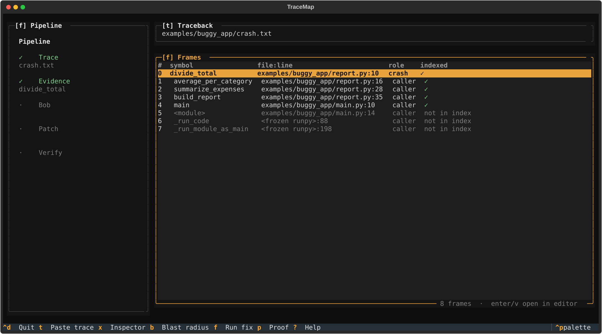
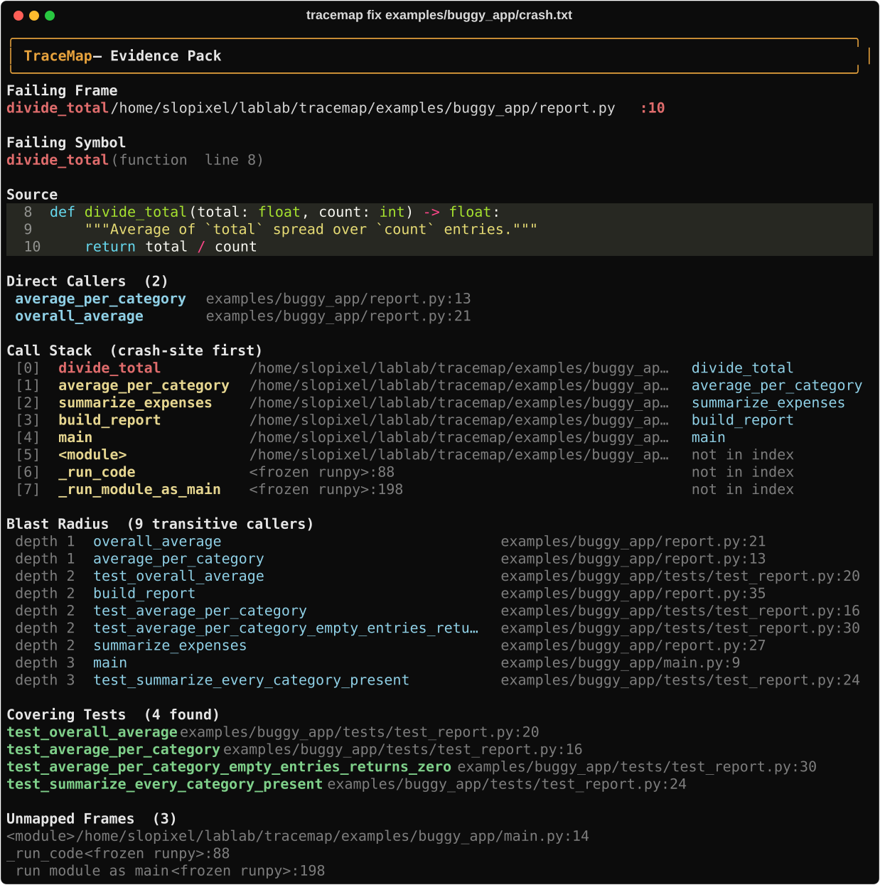
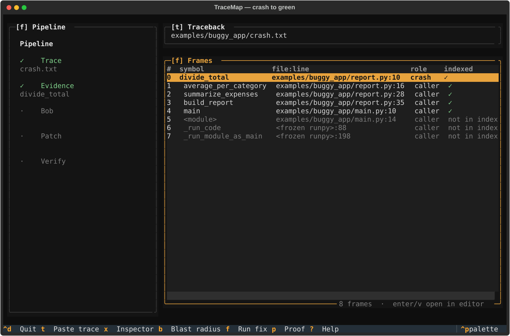
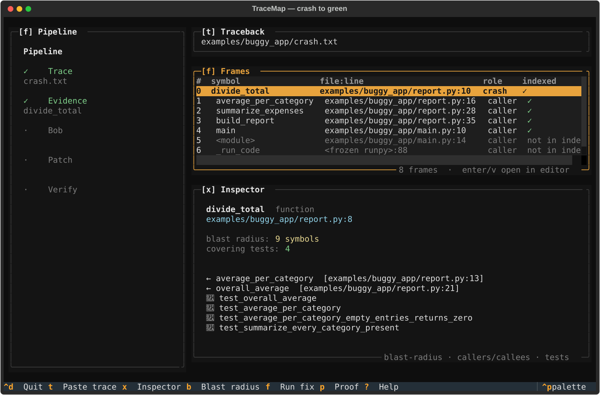
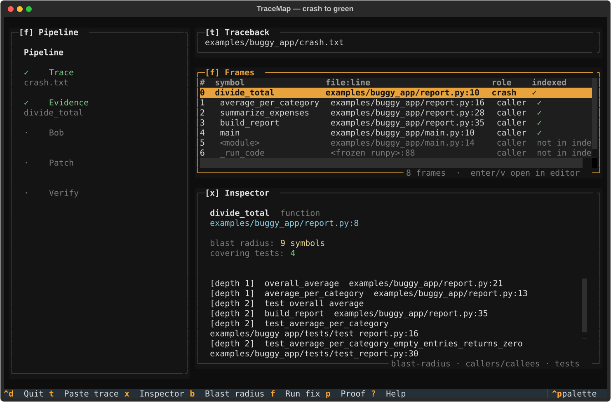
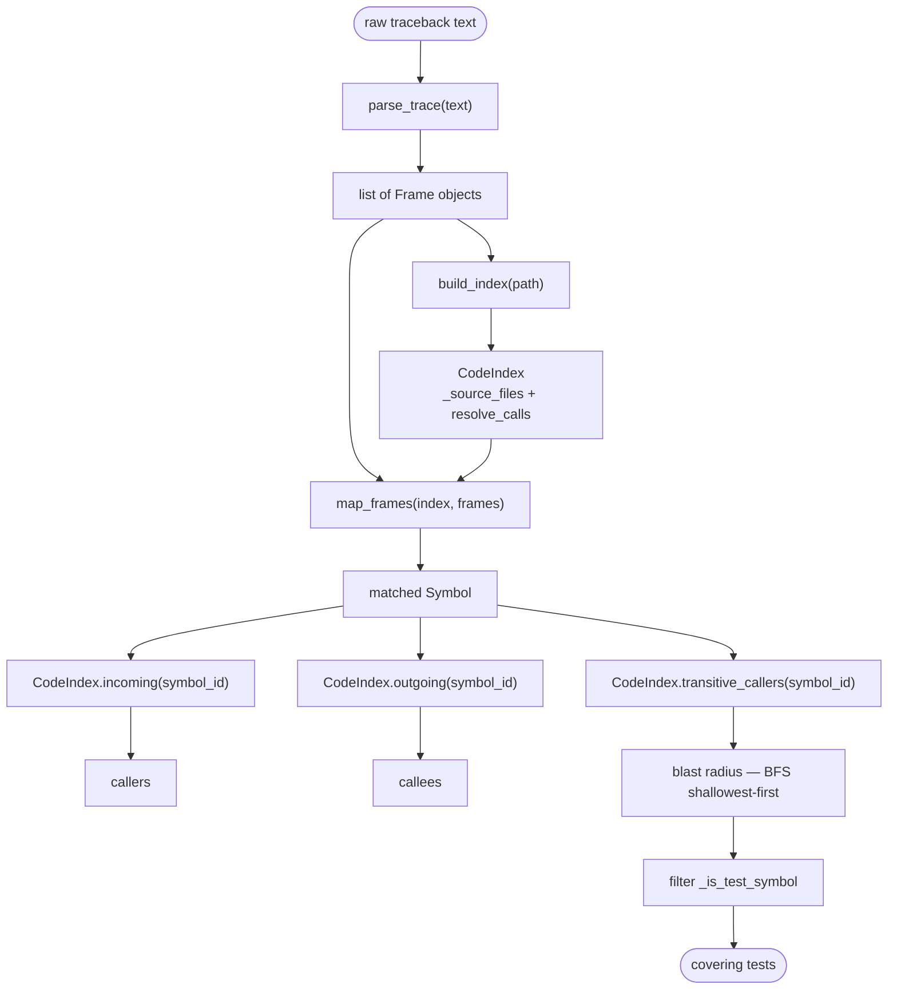
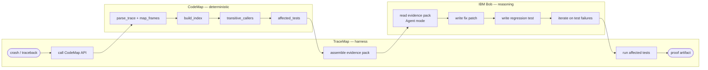

# TraceMap

**Crash to green — a failing Python traceback becomes a verified fix.**



TraceMap turns a runtime exception into a proven, committed fix in three steps:

1. **Map** — [CodeMap](https://github.com/Slo-Pix/codemap) parses the traceback and indexes the repository, resolving every frame to the exact failing symbol together with its callers, callees, blast radius, and covering tests.
2. **Fix** — IBM Bob 2.0 (running in the custom `tracemap-fixer` mode) reads the compact evidence pack and writes a minimal root-cause patch plus a regression test that **fails before the fix and passes after**.
3. **Verify** — TraceMap runs the covering tests with pytest and checks that no previously-passing test regressed.

The result is a structured proof: application exits with code 0, the new regression test is red on the original code and green on the patch, and every pre-existing test still passes.

Built for the **IBM Bob 2.0 Hackathon** (Sep 25–27, 2026).

---

## Why

A green test suite does not mean the application works — it means the test suite does not exercise the broken path. TraceMap closes that gap by:

- building a precise call-graph from the live traceback (no LLM guessing), and
- delegating reasoning to IBM Bob only after the evidence is deterministic.

IBM Bob is used at **two distinct moments**:

| Moment | Role |
|---|---|
| **Build time** | Bob authored TraceMap itself — every module was written, refined, and debugged by Bob acting as a coding agent (Agent mode). |
| **Runtime** | Bob reads the generated evidence pack in `tracemap-fixer` mode and writes the fix + regression test for *your* crash. |

---

## Install

Requires Python 3.11+. TraceMap is not on PyPI; install from source.

CodeMap is a dependency and is also installed from source:

```sh
# 1. the dependency — CodeMap (Apache-2.0)
git clone https://github.com/Slo-Pix/codemap.git
pip install ./codemap

# 2. TraceMap
git clone https://github.com/Slo-Pix/TraceMap.git
cd TraceMap
pip install -e ".[dev]"
```

Verify:

```sh
pytest                                      # 38 tests
tracemap fix examples/buggy_app/crash.txt   # the demo crash
```

To let Bob act as the fix engine, also install the custom mode and Skill —
see [`bob_config/README.md`](bob_config/README.md).

---

## Usage

### Fix a crash from a file

```sh
tracemap fix examples/buggy_app/crash.txt
```




### Fix a crash from stdin

```sh
python -m myapp 2>&1 | tracemap fix -
```

### Textual TUI

```sh
tracemap              # opens TUI
tracemap tui examples/buggy_app/crash.txt   # pre-loads a crash file
```



Press `x` for the inspector — the failing function's source, its callers and callees:



Press `b` for the blast radius — every transitive caller, depth-ranked, and the tests covering them:




---

## Real `tracemap fix` transcript

The following terminal session was recorded live during task07. Nothing is fabricated.

### The crash

```
$ cd tracemap && python -m examples.buggy_app.main
Traceback (most recent call last):
  File "<frozen runpy>", line 198, in _run_module_as_main
  File "<frozen runpy>", line 88, in _run_code
  File "/home/slopixel/lablab/tracemap/examples/buggy_app/main.py", line 14, in <module>
    main()
  File "/home/slopixel/lablab/tracemap/examples/buggy_app/main.py", line 10, in main
    print(build_report(load_expenses()))
          ^^^^^^^^^^^^^^^^^^^^^^^^^^^^^
  File "/home/slopixel/lablab/tracemap/examples/buggy_app/report.py", line 35, in build_report
    averages = summarize_expenses(expenses)
               ^^^^^^^^^^^^^^^^^^^^^^^^^^^^
  File "/home/slopixel/lablab/tracemap/examples/buggy_app/report.py", line 28, in summarize_expenses
    category: average_per_category(entries_for(expenses, category))
              ^^^^^^^^^^^^^^^^^^^^^^^^^^^^^^^^^^^^^^^^^^^^^^^^^^^^^
  File "/home/slopixel/lablab/tracemap/examples/buggy_app/report.py", line 16, in average_per_category
    return divide_total(total, len(entries))
           ^^^^^^^^^^^^^^^^^^^^^^^^^^^^^^^^^
  File "/home/slopixel/lablab/tracemap/examples/buggy_app/report.py", line 10, in divide_total
    return total / count
           ~~~~~~^~~~~~~
ZeroDivisionError: division by zero
EXIT:1
```

### `tracemap fix` output

```
$ cd tracemap && tracemap fix examples/buggy_app/crash.txt

◐ Reading traceback …
 ✓ Repo root: /home/slopixel/lablab/tracemap
 ◐ Indexing repo and mapping frames …
 ✓ Evidence built — failing symbol: divide_total
```

**Failing symbol:** `divide_total` — `examples/buggy_app/report.py` line 8

**Direct callers (from pack.md):**

```
- `average_per_category` — examples/buggy_app/report.py:13
- `overall_average`      — examples/buggy_app/report.py:19
```

**Blast radius:**

| depth | symbol | path |
|---|---|---|
| 1 | `overall_average` | `examples/buggy_app/report.py:19` |
| 1 | `average_per_category` | `examples/buggy_app/report.py:13` |
| 2 | `test_overall_average` | `examples/buggy_app/tests/test_report.py:20` |
| 2 | `build_report` | `examples/buggy_app/report.py:33` |
| 2 | `test_average_per_category` | `examples/buggy_app/tests/test_report.py:16` |
| 2 | `summarize_expenses` | `examples/buggy_app/report.py:25` |
| 3 | `main` | `examples/buggy_app/main.py:9` |
| 3 | `test_summarize_every_category_present` | `examples/buggy_app/tests/test_report.py:24` |

### Patch applied by Bob

```diff
 def average_per_category(entries: list[dict[str, object]]) -> float:
     """Mean amount across one category's entries."""
+    if not entries:
+        return 0.0
     total = sum(float(entry["amount"]) for entry in entries)
     return divide_total(total, len(entries))
```

### Regression test (written by Bob)

```python
def test_average_per_category_empty_entries_returns_zero():
    """average_per_category([]) must return 0.0, not raise ZeroDivisionError.

    Regression for: ZeroDivisionError in divide_total when a category has no
    expense records (e.g. 'training' in the real dataset).
    Fix site: average_per_category — guard added before calling divide_total.
    """
    assert average_per_category([]) == 0.0
```

### Suite green after patch

```
$ cd tracemap && python -m pytest examples/buggy_app/tests/ -v
============================= test session starts ==============================
platform linux -- Python 3.12.3, pytest-9.1.1, pluggy-1.6.0
collected 4 items

examples/buggy_app/tests/test_report.py ....                             [100%]

============================== 4 passed in 0.01s ==============================
EXIT:0
```

### Application exits 0

```
$ cd tracemap && python -m examples.buggy_app.main
travel        250.00
meals          42.50
hardware     1299.00
training        0.00
ALL           460.38
EXIT:0
```

`training` correctly shows `0.00` (no filings this period).

---

## Architecture

### How CodeMap turns a traceback into evidence



### TraceMap end to end



The crash flows left-to-right through three clearly separated actors: CodeMap deterministically maps the evidence (no LLM guessing), IBM Bob reasons over that evidence to write a fix and a regression test, and the TraceMap harness orchestrates the handoffs and verifies the fail-before / pass-after proof.

---

## CodeMap

TraceMap depends on [**CodeMap**](https://github.com/Slo-Pix/codemap) (`codemap-explorer` on PyPI), a pre-existing open-source static call-graph engine authored by the same team.

> **License note:** CodeMap is released under the **Apache 2.0** license. TraceMap itself is **MIT**. The Apache 2.0 license is compatible with MIT for downstream use; attribution is preserved in the `NOTICE` file at the root of this repository.

---

## License

MIT — see [`LICENSE`](LICENSE).
