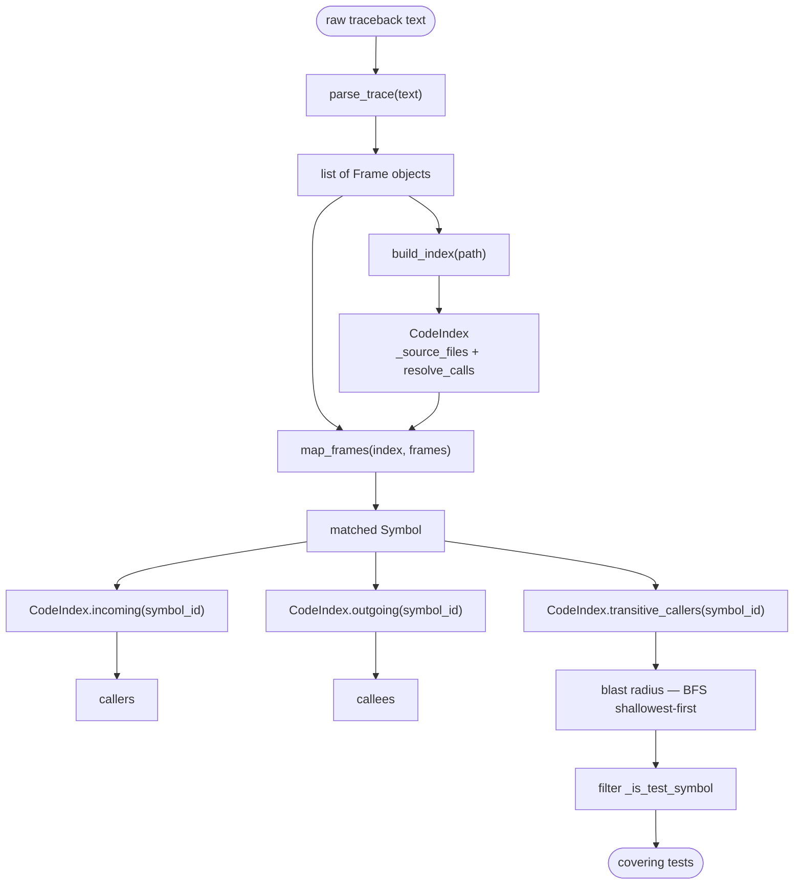
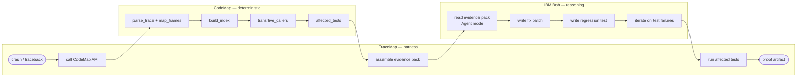

# TraceMap — Architecture

## Diagram 1 — How CodeMap turns a traceback into evidence

Each frame in the raw traceback is resolved to an indexed `Symbol` by `map_frames()`, then CodeMap's graph queries expose the full caller/callee web and blast radius so nothing relevant to the crash is overlooked.

---

## Diagram 2 — TraceMap end to end

The crash flows left-to-right through three clearly separated actors: CodeMap deterministically maps the evidence (no LLM guessing), IBM Bob reasons over that evidence to write a fix and a regression test, and the TraceMap harness orchestrates the handoffs and verifies the fail-before / pass-after proof.
